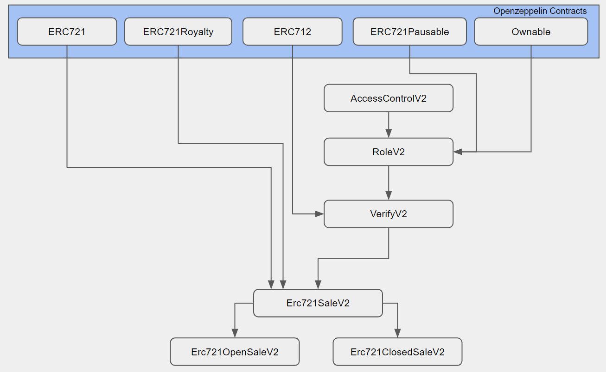

# Salesforce NFT Project

## Introduction:

The purpose of this project is to develop the SmartContracts for an NFT platform on Salesforce's CommerceCloud environment.

## Development tools and environment:

- EVM based chains
- Solidity
- Truffle development tools
- Ganache
- Openzeppelin
- VSCode
- Typescript

## SmartContract Design:

The SmartContracts have been developed in accordance to the requirements provided by Salesforce. The standard contracts provided by the `Openzeppelin` library have been leveraged for the basic Erc721 functionlity.  
The following diagram shows the hierarchy of the various SmartContracts in the project.

  

## Project Features

The following are the two Erc721 contracts that are deployable, and the features supported by each:

### Erc721OpenSaleV2

- Initial Sale `Activation` and `Deactivation`.
- `Pause` functionality at the contract level. Pausing the contract will:
  - pause all Admin tasks on the contract
  - pause all token transfers ( _even on secondary sales_ )
- Access control and verification using Roles:
  - `CONTRACT_ADMIN_ROLE`
  - `FINANCE_ADMIN_ROLE`
  - `VOUCHER_SIGNER_ROLE`
- Optional `Royalties`, built into the contract.
- Support for `Erc2981` ( _Royalty Std._ )
- Royalty payments to multiple payees enabled using `PaymentSplitter`.
- Support for `Erc712` Type Data (V4) signing and verification.
- All Admin tasks are covered with optional/configurable `MultiSig` protection. The `MultiSig` tracking is done off-chain, and verification is done on-chain in the contract.
- Lazy Minting by consumer, one token at a time. ( _TokenId generated external to the contract_ ).
- `Voucher` based minting. ( _A Voucher is created and signed off-chain by the VOUCHER_SIGNER_ROLE and required for minting._ )
- `Token Pausing`. This will allow pausing of transactions/transfers on specific TokenIds.
- Managing maximum tokens that can be owned by a wallet.
- Providing a Max Supply, thus limiting the supply of tokens.
- Withdrawing funds on demand when the contract has a balance.
- Compatible with marketplaces for secondary sales ( _e.g: OpenSea_ )
- This contract can be found in the repo here: `contracts\phase-3\Erc721OpenSaleV2.sol`

### Erc721ClosedSaleV2

- Provenance Hash for Images/Metadata.
- Initial Sale `Activation` and `Deactivation`.
- `Pause` functionality at the contract level. Pausing the contract will:
  - pause all Admin tasks on the contract
  - pause all token transfers ( _even on secondary sales_ )
- Access control and verification using Roles:
  - `CONTRACT_ADMIN_ROLE`
  - `FINANCE_ADMIN_ROLE`
  - `VOUCHER_SIGNER_ROLE`
- Optional `Royalties`, built into the contract.
- Support for `Erc2981` ( _Royalty Std._ )
- Royalty payments to multiple payees enabled using `PaymentSplitter`.
- Support for `Erc712` Type Data (V4) signing and verification.
- All Admin tasks are covered with optional/configurable `MultiSig` protection. The `MultiSig` tracking is done off-chain, and verification is done on-chain in the contract.
- Lazy Minting by consumer, supporting mutliple tokens at a time. ( _TokenId is auto-generated incrementally in the contract_ )
- `Voucher` based minting. ( _A Voucher is created and signed off-chain by the VOUCHER_SIGNER_ROLE and required for minting._ )
- `Token Pausing`. This will allow pausing of transactions/transfers on specific TokenIds.
- Displaying the same Image/Matadata for every token until a `Reveal` of the sale is done.
- `Revealing` of the sale updates the `baseURI` to the actual IPFS links, and randomizes the association of the TokenId with the Image/Metadata based on an OffsetIndexId generated randomly.
- Managing maximum tokens that can be owned by a wallet.
- Managing maximum tokens that can be minted in a transaction.
- Providing a Max Supply, thus limiting the supply of tokens.
- Withdrawing funds on demand when the contract has a balance.
- Compatible with marketplaces for secondary sales ( _e.g: OpenSea_ )
- This contract can be found in the repo here: `contracts\phase-3\Erc721ClosedSaleV2.sol`

## Naming Conventions in the SmartContract

- _private_ variables/methods are prefixed with `_` ( _e.g: `string private _contractURI;`_ )
- _public_ variables/methods have no suffix/prefix ( _e.g: `uint256 public maxSupply;`_ )
- _method parameters_ are suffixed with `_` ( _e.g: `function mintTokens(uint256 tokenCount_ ) external payable { }`\_ )

## Error Messages

In order to optimize the code size in the Contract ( _due to **Spurious Dragon** EIP-170 contract size limit_ ), all Error messages in `require( )` statements have been replaced with Error Codes. The _description_ for each of the Error Code can be found in the following file:
`scripts\phase-3\error_codes.ts`.

This is only for the SmartContracts in this repository. All base class SmartContracts ( _Openzepplin_ ) have not been changed, and display their original Error Messages.

## Working with the project

The latest/current contracts are located in the repo here: `contracts\phase-3`.

- `npm install` - to install all the dependencies.
- `npm run compile` - to compile the contracts.
- `npm test` - to run the unit tests.
- `npm run verify <ContractName>@<ContractAddress>` - to verify a deployed contract on `rinkeby`.
  - e.g.: `npm run verify Erc721ClosedSaleV2@0xF4d29c64e2B8b4154B3407376F381bf67a2f3D4C`
  - ( _This requires an `.env` file. See next section._ )

To run the E2E Workflow scripts:

- Create an `.env` file at the root, and copy over the variables provided in the `.env.sample` file.
- Update the `.env` file with valid values for the variables ( _the sample variable values are just for illustration_ )
- Run a local version of `ganache` as a backend for the scripts. Also make sure the `.env` file's `CHAIN_ID` and `RPC_ENDPOINT` refer to locally running `ganache` instance.

  - `ganache -a 20 -m "<MNEMONIC>"`
  - `-a 20` will create 20 accounts pre-filled with 1000 ETH.
  - `<MNEMONIC>` - use the one from the `.env` file.

- `ts-node scripts/phase-3/e2e_workflow_opensale.ts` - to run all the actions related to an Open sale.
- `ts-node scripts/phase-3/e2e_workflow_closedsale.ts` - to run all the actions related to an Closed sale.
